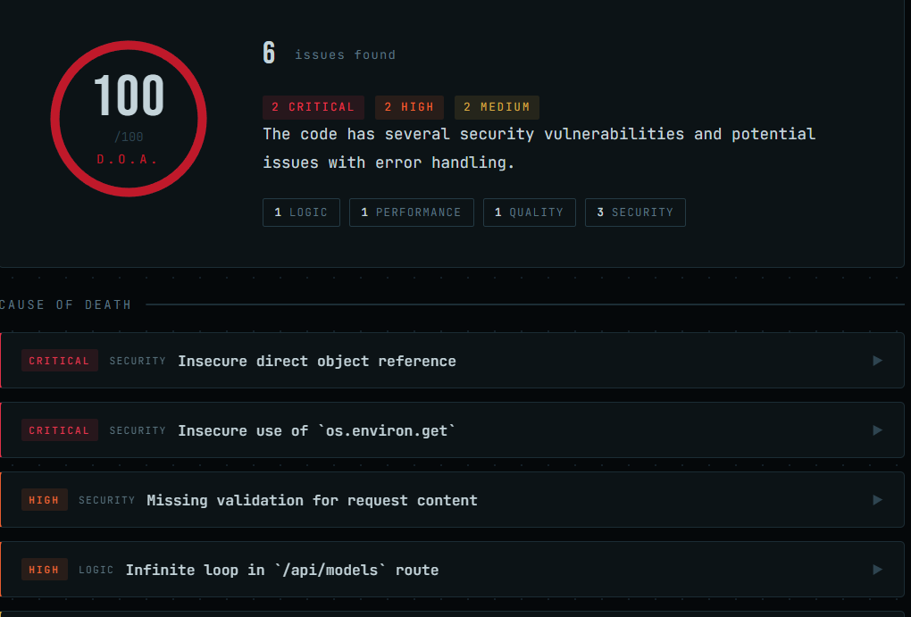

<div align="center">

```
 █████╗ ██╗   ██╗████████╗ ██████╗ ██████╗ ███████╗██╗   ██╗
██╔══██╗██║   ██║╚══██╔══╝██╔═══██╗██╔══██╗██╔════╝╚██╗ ██╔╝
███████║██║   ██║   ██║   ██║   ██║██████╔╝███████╗ ╚████╔╝ 
██╔══██║██║   ██║   ██║   ██║   ██║██╔═══╝ ╚════██║  ╚██╔╝  
██║  ██║╚██████╔╝   ██║   ╚██████╔╝██║     ███████║   ██║   
╚═╝  ╚═╝ ╚═════╝    ╚═╝    ╚═════╝ ╚═╝     ╚══════╝   ╚═╝   
```

**Your code is dead. Let's find out why.**

[](https://python.org)
[](https://flask.palletsprojects.com)
[](https://ollama.com)
[](LICENSE)
[]()

</div>

---

## What is Autopsy?

Autopsy is a **local-first, AI-powered code forensics tool** for vibe coders, junior developers, and anyone who ships code they don't fully understand. It takes your code — from a GitHub repo, a pasted snippet, or an uploaded file — and performs a full forensic analysis. No cloud. No API keys. No data leaving your machine.

It finds what's broken, explains it in plain English, scores how bad it is, and tells you exactly how to fix it.

> First thing we did after building Autopsy was run it on its own source code.
> It gave itself a **D.O.A. — Risk Score: 100/100.**
> Honestly, best demo possible. The tool works.

---

## Demo

<div align="center">



*Autopsy diagnosing its own source code on first run.*

</div>

---

## Features

| Feature | Description |
|--------|-------------|
| 🔬 **Forensic Analysis** | Finds bugs, security holes, logic errors, and bad patterns |
| 📋 **Plain English** | Every issue explained for someone who barely knows code |
| ⚡ **Risk Score 0–100** | Weighted by severity — from Healthy to D.O.A. |
| 🔧 **Fix Suggestions** | Copy-paste ready fix for every single issue |
| 🌐 **Any Language** | Python, JS, TS, Java, C, C++, Go, Rust, PHP, C#, Swift, Kotlin, SQL, and more |
| 🔒 **100% Local** | Ollama runs the LLM on your hardware — nothing leaves your machine |
| 📁 **Three Input Methods** | GitHub URL, paste code, or upload a file |
| 🎨 **Dark Forensic UI** | Built different. Looks like a crime scene report. |

---

## Risk Score System

Autopsy scores your code from 0 to 100 based on what it finds:

| Score | Label | Meaning |
|-------|-------|---------|
| 0 – 15 | 🟢 **Healthy** | Clean code, minor style issues at worst |
| 16 – 35 | 🟡 **Unstable** | Real problems — fix before deploying |
| 36 – 60 | 🟠 **Critical** | Significant bugs or security issues |
| 61 – 85 | 🔴 **Fatal** | Serious vulnerabilities, likely to break |
| 86 – 100 | ⚫ **D.O.A.** | Dead on arrival — don't ship this |

Each issue contributes to the score based on severity:

```
Critical  →  +30 pts   (security breach, data exposure, auth bypass)
High      →  +15 pts   (crashes, data loss, infinite loops)
Medium    →   +6 pts   (wrong behavior, bad error handling)
Low       →   +2 pts   (code smell, poor practice)
```

---

## Requirements

- **Python 3.9+**
- **[Ollama](https://ollama.com)** installed and running locally
- At least one Ollama model pulled (see [Recommended Models](#recommended-models))

---

## Installation

### 1. Clone the repository

```bash
git clone https://github.com/flawnlawyer/autopsy.git
cd autopsy
```

### 2. Install Python dependencies

```bash
pip install -r requirements.txt
```

### 3. Start Ollama

> ⚠️ **Ollama must be running in a separate terminal before you start Autopsy.**

```bash
# Terminal 1 — keep this open
ollama serve
```

### 4. Pull a model

```bash
ollama pull llama3
```

### 5. Run Autopsy

```bash
# Terminal 2
python app.py
```

Open **[http://localhost:5000](http://localhost:5000)** in your browser.

---

## Troubleshooting: Ollama Offline Error

If you see this error in Autopsy:

```
Error: Cannot connect to Ollama. Make sure it is running: ollama serve
```

Work through these steps in order.

---

### ✅ Step 1 — Run Ollama and Autopsy in separate terminals

This is the most common mistake. They **must** run simultaneously in two separate terminal windows.

```
Terminal 1            Terminal 2
─────────────         ─────────────────
ollama serve    +     python app.py
(keep open)           (keep open)
```

Do **not** run both commands in the same terminal. The second one will never start.

---

### ✅ Step 2 — Verify Ollama is actually reachable

```bash
curl http://localhost:11434
```

Expected response: `Ollama is running`

If you get a connection error — Ollama is not running. Go back to Step 1.

---

### ✅ Step 3 — Check you have at least one model installed

```bash
ollama list
```

If the output is empty, pull a model:

```bash
ollama pull llama3

# Or a lighter model for low-end hardware:
ollama pull phi3
```

Autopsy's model dropdown will be empty if no models are installed, even if Ollama is running.

---

### ✅ Step 4 — Ollama on a custom port or remote host

If your Ollama runs on a different port or a different machine on your network, tell Autopsy where to find it:

```bash
# Custom port
OLLAMA_HOST=http://localhost:11435 python app.py

# Remote machine
OLLAMA_HOST=http://192.168.1.50:11434 python app.py
```

---

### ✅ Step 5 — Firewall blocking port 11434

**Windows:** Check Windows Defender Firewall and allow Ollama through, or test with the firewall temporarily disabled.

**Linux:**
```bash
sudo ufw allow 11434
```

**macOS:** Usually not an issue, but check System Preferences → Security & Privacy if problems persist.

---

### ✅ Step 6 — Reinstall Ollama

If none of the above works, a clean reinstall usually fixes it:

```bash
# macOS
brew reinstall ollama

# Linux
curl -fsSL https://ollama.com/install.sh | sh

# Windows
# Download the installer from https://ollama.com and reinstall
```

Then restart your machine and follow from Step 1.

---

## Recommended Models

| Model | Quality | Speed | Notes |
|-------|---------|-------|-------|
| `llama3` | ★★★★★ | ★★★★ | Best overall — recommended default |
| `mistral` | ★★★★☆ | ★★★★ | Strong alternative, great at code |
| `codellama` | ★★★★☆ | ★★★ | Specialised for code analysis |
| `gemma2` | ★★★★☆ | ★★★★ | Good balance of speed and quality |
| `phi3` | ★★★☆☆ | ★★★★★ | Fastest — good for low-end hardware |

Pull any model with:

```bash
ollama pull <model-name>
```

For best analysis quality, use `llama3` or `mistral`. For speed on limited hardware, use `phi3`.

---

## Usage Guide

### Paste Code

Paste any code snippet into the editor. Autopsy auto-detects the language. Works for anything from a 5-line function to hundreds of lines.

### GitHub URL

Paste a public GitHub repository URL. Autopsy will:

- Clone the repo locally with `depth=1` (fast, no full history)
- Skip non-code directories (`node_modules`, `.git`, `venv`, `dist`, `build`, etc.)
- Prioritize entry-point files (`app.py`, `main.go`, `index.js`, etc.)
- Stay within a safe 7,500 character context window

> Requires GitPython — already in `requirements.txt`. Public repos only in v1.0.

### Upload File

Upload any single source file. Drag and drop supported. All major languages and extensions accepted.

### Model Selection

The model dropdown auto-populates from your installed Ollama models. If it shows only defaults and not your installed models, check the status dot in the top-right corner — if it's red, Ollama is offline.

---

## Project Structure

```
autopsy/
│
├── app.py                    # Flask entry point — routes and API
│
├── core/
│   ├── __init__.py
│   ├── parser.py             # Input parsing (GitHub URL, paste, file upload)
│   ├── ollama_client.py      # Ollama LLM interface + structured forensic prompt
│   └── report.py             # Risk scoring algorithm + report assembly
│
├── templates/
│   └── index.html            # Complete web UI — no build step required
│
├── static/                   # Reserved for future static assets
├── requirements.txt
└── README.md
```

---

## How It Works

```
Your Code  (paste / GitHub URL / file upload)
     │
     ▼
 ┌─────────────────────────────────┐
 │     Parser & Chunker            │
 │  Detect language                │
 │  Chunk large files              │
 │  Build context map (repos)      │
 └─────────────────────────────────┘
     │
     ▼
 ┌─────────────────────────────────┐
 │     Ollama Local LLM            │
 │  Structured forensic prompt     │
 │  Forces JSON output             │
 │  Three fallback parse layers    │
 └─────────────────────────────────┘
     │
     ▼
 ┌───────────┬────────────┬────────────┐
 │  Bug      │   Fix      │   Risk     │
 │ Detector  │ Suggester  │  Scorer    │
 └───────────┴────────────┴────────────┘
     │
     ▼
 ┌─────────────────────────────────┐
 │     Report Builder              │
 │  Unified forensic report JSON   │
 └─────────────────────────────────┘
     │
     ▼
 ┌─────────────────────────────────┐
 │     Flask Web UI                │
 │  Cause-of-death cards           │
 │  Animated risk gauge            │
 │  Expandable fix suggestions     │
 └─────────────────────────────────┘
```

The entire analysis is a single round-trip to Ollama. The prompt is engineered to force structured JSON output, with three fallback extraction strategies if the model returns unformatted text. Temperature is set to `0.1` for deterministic, consistent results.

---

## API Reference

Autopsy exposes three endpoints internally:

### `GET /`
Returns the web UI.

### `GET /api/models`
Returns available Ollama models and connection status.

```json
{
  "models": ["llama3", "mistral", "codellama"],
  "status": "online"
}
```

### `POST /api/analyse`
Runs a full forensic analysis.

**Form fields:**

| Field | Type | Description |
|-------|------|-------------|
| `type` | string | `paste`, `url`, or `file` |
| `model` | string | Ollama model name |
| `content` | string | Code (paste) or GitHub URL |
| `file` | file | Uploaded file (when type=file) |

**Response:**

```json
{
  "meta": {
    "source": "paste",
    "name": "pasted code",
    "language": "Python",
    "analysed_at": "2026-03-23 14:02 UTC",
    "total_issues": 6
  },
  "risk": {
    "score": 100,
    "label": "D.O.A.",
    "color": "#c0192a",
    "breakdown": { "security": 3, "logic": 1, "performance": 1, "quality": 1 }
  },
  "summary": "The code has several security vulnerabilities and poor error handling.",
  "issues": [
    {
      "id": 1,
      "severity": "critical",
      "category": "security",
      "title": "Insecure direct object reference",
      "explanation": "...",
      "snippet": "...",
      "fix": "..."
    }
  ]
}
```

---

## Configuration

| Environment Variable | Default | Description |
|----------------------|---------|-------------|
| `OLLAMA_HOST` | `http://localhost:11434` | Ollama server address |

---

## Roadmap

- [ ] Private GitHub repo support (personal access token)
- [ ] Per-chunk analysis for very large repos
- [ ] Export report as PDF or Markdown
- [ ] Side-by-side diff view for suggested fixes
- [ ] CLI mode — `autopsy analyse ./myproject`
- [ ] `.zip` archive upload support
- [ ] VS Code extension
- [ ] Autopsy v2 — compare two commits, track code health over time

---

## Contributing

Pull requests are welcome. Please open an issue first to discuss major changes.

```bash
# Fork, then:
git checkout -b feature/your-feature-name
git commit -m "feat: describe your change"
git push origin feature/your-feature-name
# Open a pull request
```

---

## Related Projects

- [**Codexia**](https://github.com/flawnlawyer/Codexia) — AI-powered code knowledge engine. Maps, explores, and explains entire GitHub repositories locally via Ollama. Think of Codexia as "understand what the code does" and Autopsy as "find what's wrong with it."

---

## Author

Built by **Ayush** — BCSIT student, open source builder, researcher.

- GitHub: [@flawnlawyer](https://github.com/flawnlawyer)
- Research: [Project 69 — Self-Governed AI Framework](https://zenodo.org/records/19107134)

---

## License

MIT © 2026 Ayush

---

<div align="center">

*Built with Flask · Ollama · dark humor · zero cloud dependencies*

**If Autopsy called your code D.O.A. — now you know where to start.**

</div>
